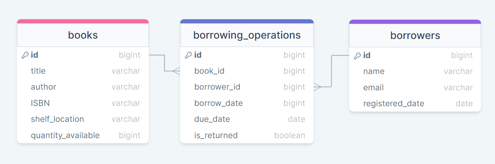

# Library Management System

## Introduction
This project is a Library Management System built using Node.js, Express.js, and PostgreSQL. It provides endpoints for managing books, borrowers, and borrowing operations in a library.

## Database Strucure


## Getting Started
To run this project locally, follow these steps:

### Prerequisites
- Ensure you have PostgreSQL installed and running on your machine.

### Installation
1. Clone this repository to your local machine.
2. Navigate to the project directory.

### Configuration
1. Create a `.env` file in the project root directory.
2. Add the following variables to the `.env` file with your database credentials:

    ```
    DATABASE_USER=your_database_user
    DATABASE_HOST=your_database_host
    DATABASE_NAME=your_database_name
    DATABASE_PASSWORD=your_database_password
    DATABASE_PORT=your_database_port
    PORT=3001
    ```

    Replace `your_database_user`, `your_database_host`, `your_database_name`, `your_database_password`, and `your_database_port` with your actual database credentials.

### Database Setup
1. Create a PostgreSQL database for the project.
2. Run the provided SQL scripts located in the `database-initialization.sql` file in the repository to create the necessary database tables.


### Running the Server
1. Install modules needed by command:
    ```bash
    npm install
    ```
2. Start the server by running the following command:

    ```bash
    npm start dev
    ```

3. The server should now be running on `http://localhost:[yourport]`.

## Usage
Once the server is running, you can use tools like Postman to interact with the API endpoints.

## API Documentation
For detailed information on the available endpoints and how to use them, refer to the provided [Postman documentation](https://documenter.getpostman.com/view/33291356/2sA35A95s4).
